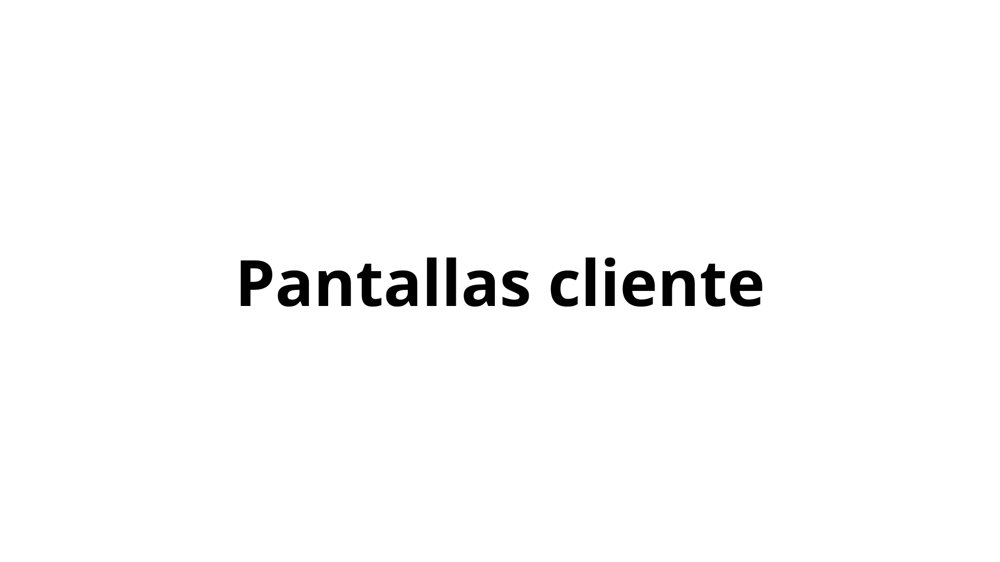
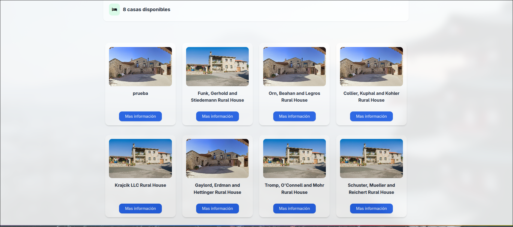
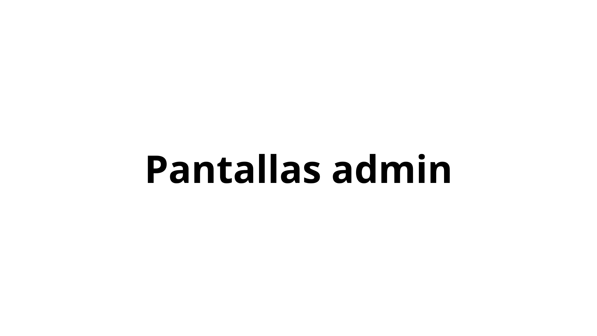

# RuralControl

## Description

This project consists of a web application where rural house owners can manage their rural houses and users can find rural houses to rent for vacations.

## Technologies and Structure

The backend will be built in **Laravel**, with **JWT** to authenticate users, and the frontend will be built in **Angular**.

My idea for the structure of the project, for now, is to have two separate APIs instead of a monolithic structure. To achieve this, it should have:

-An API for users.

-An API for reservations, houses, etc.

Each API would communicate with each other via **HTTP**. From the Angular frontend, these two APIs would have to be consumed separately.
This would allow:

1. Connecting the APIs separately.
2. Testing a different architecture, since until now all applications have been monolithic with a single backend.

# Use Cases

# Steps to run the application

- Clone the GitHub repository
- On the frontend side, run npm install to install the dependencies
- On the backend side, in both the User and Home APIs, run composer dump-autoload to install the dependencies.
- Run ng serve on the front end
- Run php Artisan serve first in the User API and then in the House API

# Views/Screens

## Client views

### All available houses

### View the house and its features

### Reservation form

### History of reservations made by the client

### Profile View

## Admin View

### Admin home screen. Here, a dashboard will appear with graphs about reservations, total funds raised, etc.

### The houses an administrator has to manage

### Form to add a new house

### Edit a house's details

# Español

## Descripción

Este proyecto consiste en una aplicación web, en la que los propietarios de casas rurales podrán gestionar las casas rurales que tienen y los usuarios podrán encontrar casas rurales para alquilarlas de vacaciones.

## Tecnologías y estructura

El backend estará hecho en **Laravel**, con **Sanctum** para poder autenticar a los usuarios, y el frontend estará hecho en **Angular**.

Mi idea de estructura para el proyecto será por ahora, tener dos apis separadas en lugar de una estructura monolítica. Para ello, debería tener:

-Una api para los usuarios.

- Una api para las reservas, casas, etc.

Cada **API** y se comunicarían por **HTTP** entre ellos. Desde el frontend en Angular, se tendrían que consumir estas dos APIs por separado.  
Esto permitiría:

1. Conectar las Apis por separado.
2. Probar con una arquitectura diferente, ya que hasta ahora todas las aplicaciones han sido monolíticas con un solo backend.

# Despliegue

Para desplegar el proyecto, tienes que descargarlo del respositorio, como el backend esta preparado solo tendras que ejecutar el comando sudo docker-compose up --build y asi arrancaras todo el Backend a la vez. Para el frontend, ademas de hacer el npm install, deberas ejecutar ng serve y todo listo para disfrutar de la aplicacion

# Casos de uso

# Pasos para poder ejecutar la aplicacion

- Clonar repositorio de github
- En la parte del Frontend, ejecutar npm install para instalar las dependencias
- En parte del backend, tanto en la Api de Usuarios como en la de casa, ejecutar composer dump-autoload para instalar las dependencias.
- Ejecutar ng serve en el Frontend
- Ejecutar php Artisan serve primero en la Api de Usuarios y despues en la de Casa

# Vistas/Pantallas

## Vistas del cliente

### Todas las casa que hay disponibles

### Ver la casa y sus caracteristicas

### Formulario para hacer la reserva

### Historial de reservas que ha hecho el cliente

### Vista Perfil

## Vista Administrador

### Pantalla de inicio del Admin, aqui aparecera un dashboard con graficas sobre las reservas el dinero total que ha conseguido, etc.

### Las casas que tiene un administrador para gestionar

### Formulario Para añadir una nueva casa

### Editar los datos de una casa

