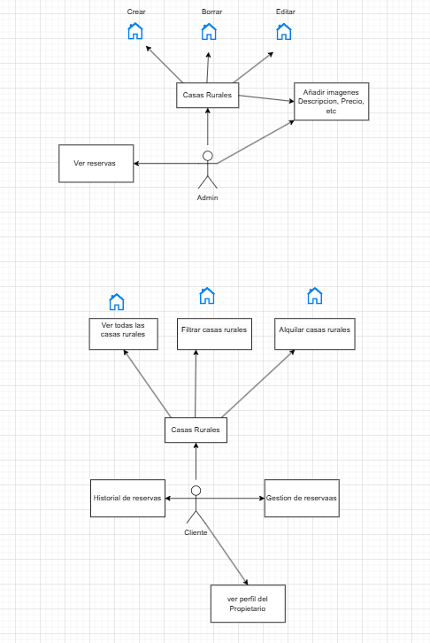
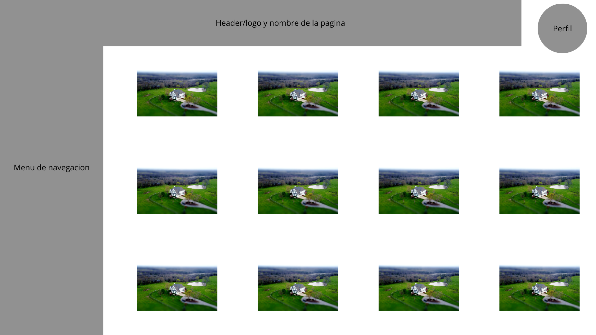
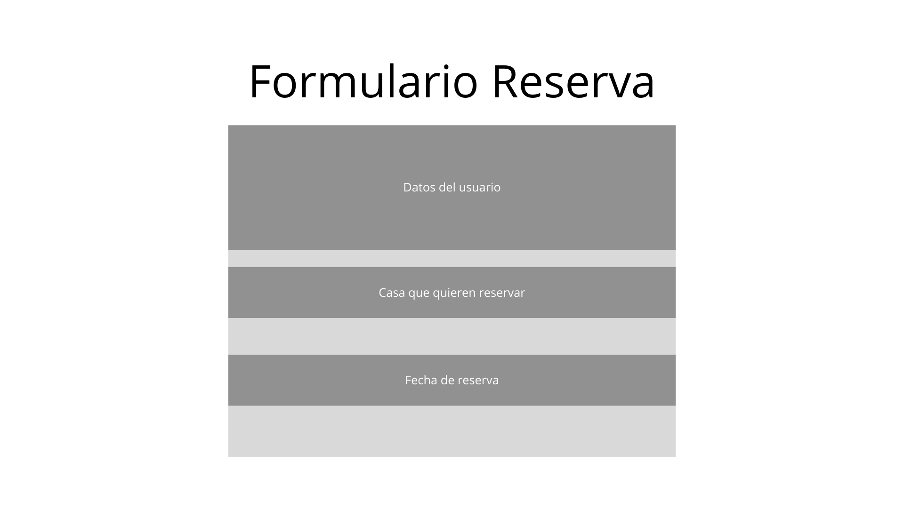
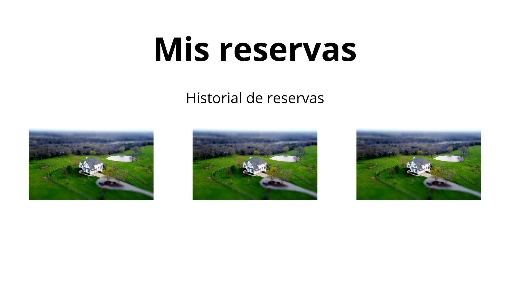
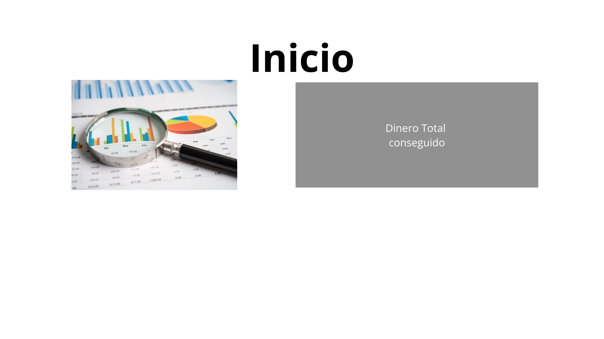
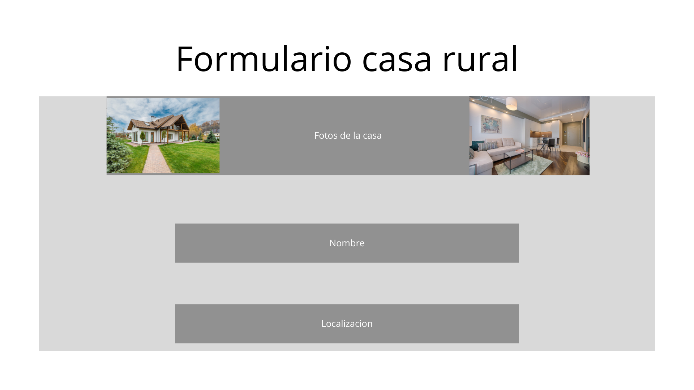

# RuralControl

## Descripción
Este proyecto consiste en una aplicación web, en la que los propietarios de casas rurales podrán gestionar las casas rurales que tienen y los usuarios podrán encontrar casas rurales para alquilarlas de vacaciones.

## Tecnologías y estructura

El backend estará hecho en **Laravel**, con **Sanctum** para poder autenticar a los usuarios, y el frontend estará hecho en **Angular**.

Mi idea de estructura para el proyecto será en **pequeños microservicios** en lugar de una estructura monolítica. Para ello, debería tener:
- **Un microservicio para los usuarios**.
- **Un microservicio para las casas rurales y las reservas**.  

Cada microservicio tendría su propia **API** y se comunicarían por **HTTP** entre ellos. Desde el frontend en Angular, se tendrían que consumir estas dos APIs por separado.  
Esto permitiría:
1. Si un backend se cae, la aplicación puede seguir funcionando y no se cae toda la aplicacion.
2. Conectar los microservicios por separado.
3. Probar con una arquitectura diferente, ya que hasta ahora todas las aplicaciones han sido monolíticas.

# Casos de uso

# Vistas/Pantallas
## Vistas del cliente

Todas las casa que hay disponibles

Formulario para hacer la reserva

Ver la casa y sus caracteristicas

Historial de reservas que ha hecho el cliente

## Vista Administrador

Pantalla de inicio del Admin, aqui aparecera un dashboard con graficas sobre las reservas el dinero total que ha conseguido, etc.

Las casas que tiene un administrador paraa gestionar

Formulario Para añadir una nueva casa

Ver la casa y las reservas que ha tenido
