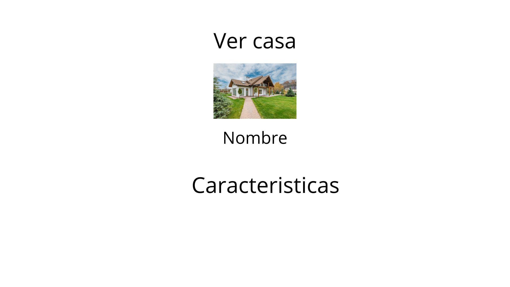
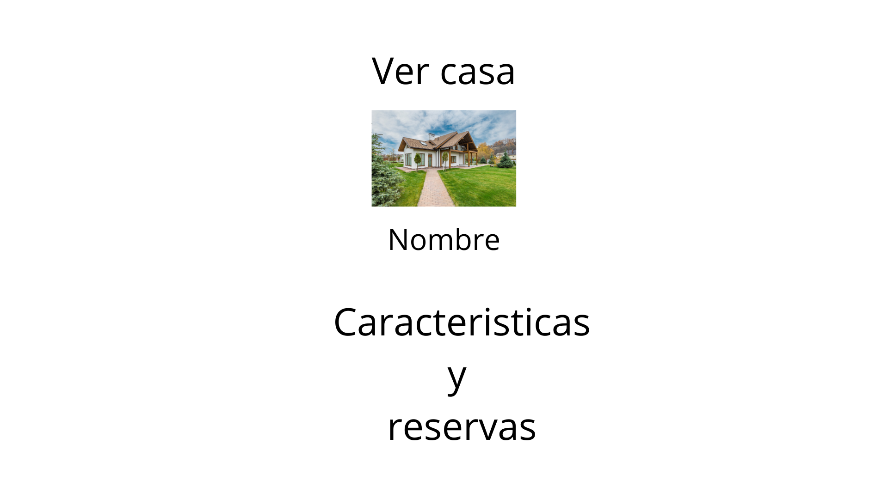

# RuralControl

## Descripción

Este proyecto consiste en una aplicación web, en la que los propietarios de casas rurales podrán gestionar las casas rurales que tienen y los usuarios podrán encontrar casas rurales para alquilarlas de vacaciones.

## Tecnologías y estructura

El backend estará hecho en **Laravel**, con **Sanctum** para poder autenticar a los usuarios, y el frontend estará hecho en **Angular**.

Mi idea de estructura para el proyecto será por ahora, tener dos apis separadas en lugar de una estructura monolítica. Para ello, debería tener:

-Una api para los usuarios.

- Una api para las reservas, casas, etc.

Cada **API** y se comunicarían por **HTTP** entre ellos. Desde el frontend en Angular, se tendrían que consumir estas dos APIs por separado.  
Esto permitiría:

1. Conectar las Apis por separado.
2. Probar con una arquitectura diferente, ya que hasta ahora todas las aplicaciones han sido monolíticas con un solo backend.

# Despliegue

Para desplegar el proyecto, tienes que descargarlo del respositorio, como el backend esta preparado solo tendras que ejecutar el comando sudo docker-compose up --build y asi arrancaras todo el Backend a la vez. Para el frontend, ademas de hacer el npm install, deberas ejecutar ng serve y todo listo para disfrutar de la aplicacion

# Casos de uso

# Vistas/Pantallas

## Vistas del cliente

### Todas las casa que hay disponibles

### Formulario para hacer la reserva

### Ver la casa y sus caracteristicas

### Historial de reservas que ha hecho el cliente

## Vista Administrador

### Pantalla de inicio del Admin, aqui aparecera un dashboard con graficas sobre las reservas el dinero total que ha conseguido, etc.

### Las casas que tiene un administrador paraa gestionar

### Formulario Para añadir una nueva casa

### Ver la casa y las reservas que ha tenido

